# 錯題本

### vector3 (64)

任務：訊號變換

[HDLBits](https://hdlbits.01xz.net/wiki/Vector3)

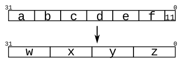

### review2015_fancytimer (156)

[HDLBits](https://hdlbits.01xz.net/wiki/Exams/review2015_fancytimer)

任務：timer

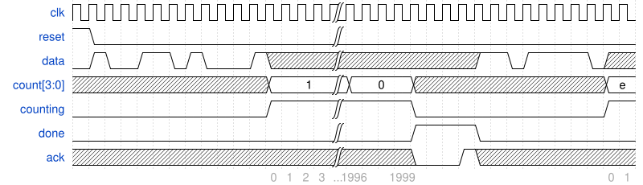

### review2015_fsmonehot (150)

任務：FSM

[HDLBits](https://hdlbits.01xz.net/wiki/Exams/review2015_fsmonehot)

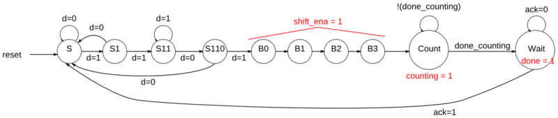

### review2015_fsm (151)

任務：FSM

[HDLBits](https://hdlbits.01xz.net/wiki/Exams/review2015_fsm)

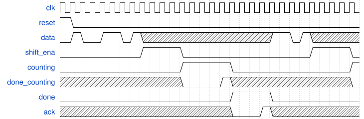

### kmap2 (57)

任務：解讀 Kmap

[HDLBits](https://hdlbits.01xz.net/wiki/Kmap2)

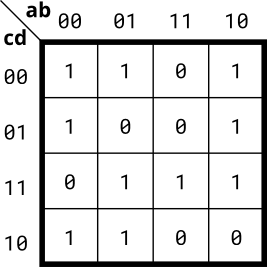

### lfsr5 (86)

任務：linear feedback shift register

[HDLBits](https://hdlbits.01xz.net/wiki/Lfsr5)

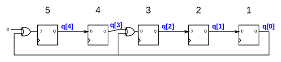

### m2014_q6b (135)

任務：FSM

[HDLBits](https://hdlbits.01xz.net/wiki/Exams/m2014_q6b)

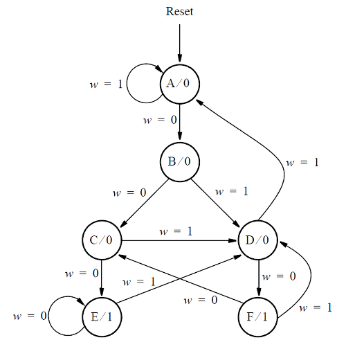

### fsm_ps2data (154)

任務：FSM

[HDLBits](https://hdlbits.01xz.net/wiki/Fsm_ps2data)

### lemmings2 (142)

任務：FSM，多種輸入決定狀態

[HDLBits](https://hdlbits.01xz.net/wiki/Lemmings2)

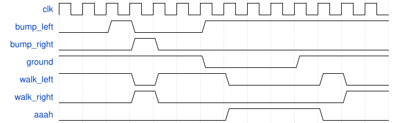

### edgecapture (66)

任務：辨認訊號變化瞬間

[HDLBits](https://hdlbits.01xz.net/wiki/Edgecapture)

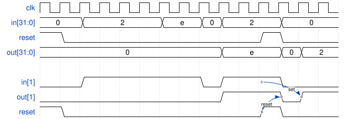

### ece241_2013_q4 (149)

[HDLBits](https://hdlbits.01xz.net/wiki/Exams/ece241_2013_q4)

### kmap3 (125)

任務：解讀 Kmap

[HDLBits](https://hdlbits.01xz.net/wiki/Kmap3)

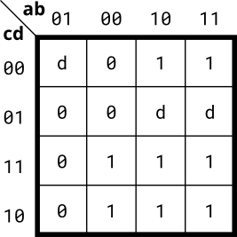

### circuit10 (147)

任務：sequential circuit

[HDLBits](https://hdlbits.01xz.net/wiki/Sim/circuit10)

### lemmings4 (155)

任務：FSM，多種輸入決定狀態

[HDLBits](https://hdlbits.01xz.net/wiki/Lemmings4)

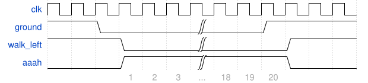
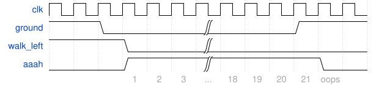

### ece241_2014_q3 (93)

任務：解讀 Kmap + MUX

[HDLBits](https://hdlbits.01xz.net/wiki/Exams/ece241_2014_q3)

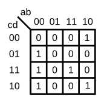

### countbcd (68)

任務：binary-coded decimal counter

[HDLBits](https://hdlbits.01xz.net/wiki/Countbcd)

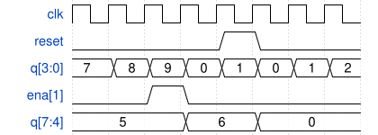

### gshare (153)

[HDLBits](https://hdlbits.01xz.net/wiki/Cs450/gshare)

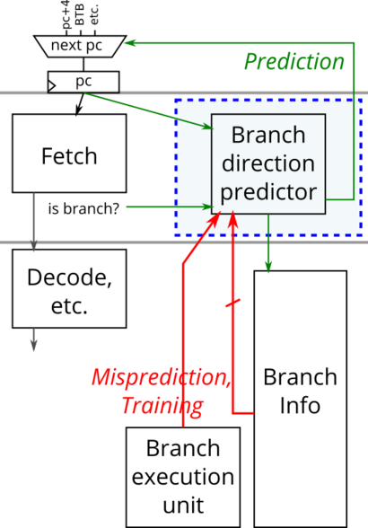
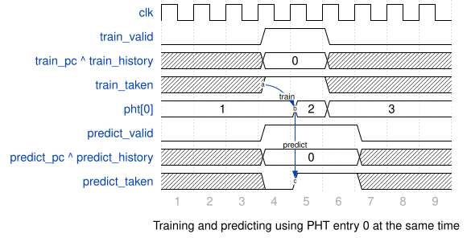

### lfsr32 (82)

任務：32-bit Galois LFSR

[HDLBits](https://hdlbits.01xz.net/wiki/Lfsr32)

### always_case2 (112)

任務：priority encoder

[HDLBits](https://hdlbits.01xz.net/wiki/Always_case2)

### 2012_q2b (91)

任務：FSM

[HDLBits](https://hdlbits.01xz.net/wiki/Exams/2012_q2b)

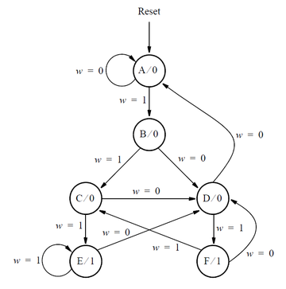

### ece241_2014_q5a (89)

任務：Moore state machine

[HDLBits](https://hdlbits.01xz.net/wiki/Exams/ece241_2014_q5a)

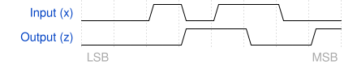

### fsm_serialdata (146)

任務：FSM

[HDLBits](https://hdlbits.01xz.net/wiki/Fsm_serialdata)

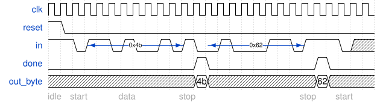

### 2013_q2bfsm (139)

任務：FSM

[HDLBits](https://hdlbits.01xz.net/wiki/Exams/2013_q2bfsm)

### fsm_serial (137)

任務：FSM

[HDLBits](https://hdlbits.01xz.net/wiki/Fsm_serial)

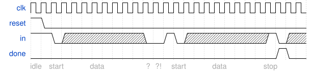

### rule110 (124)

任務：one-dimensional cellular automaton

[HDLBits](https://hdlbits.01xz.net/wiki/Rule110)

| Left | Center | Right | Center's next state |
|------|--------|-------|---------------------|
| 1    | 1      | 1     | 0                   |
| 1    | 1      | 0     | 1                   |
| 1    | 0      | 1     | 1                   |
| 1    | 0      | 0     | 0                   |
| 0    | 1      | 1     | 1                   |
| 0    | 1      | 0     | 1                   |
| 0    | 0      | 1     | 1                   |
| 0    | 0      | 0     | 0                   |

### ece241_2013_q2 (70)

任務：single-output digital system

[HDLBits](https://hdlbits.01xz.net/wiki/Exams/ece241_2013_q2)

### kmap4 (122)

任務：解讀 Kmap

[HDLBits](https://hdlbits.01xz.net/wiki/Kmap4)

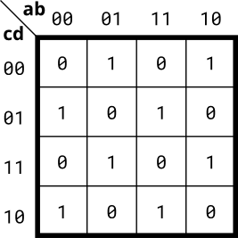
