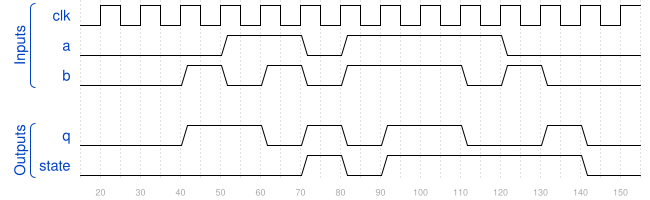
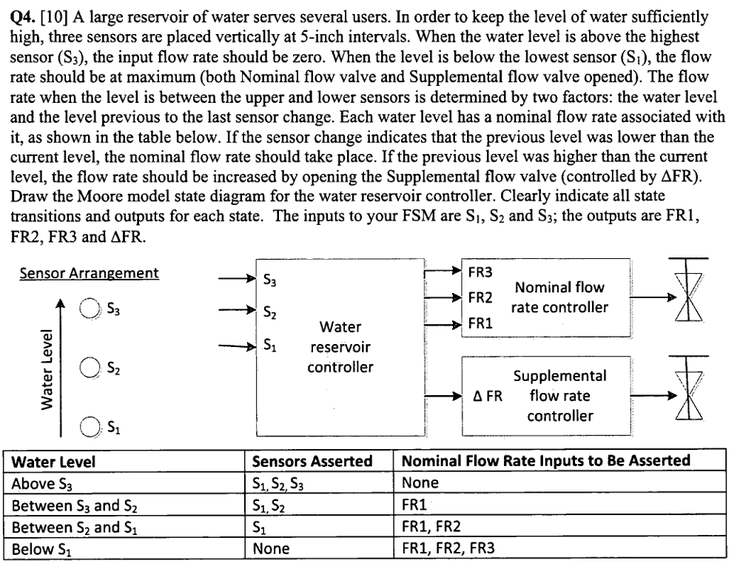
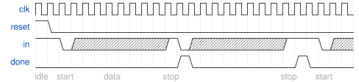
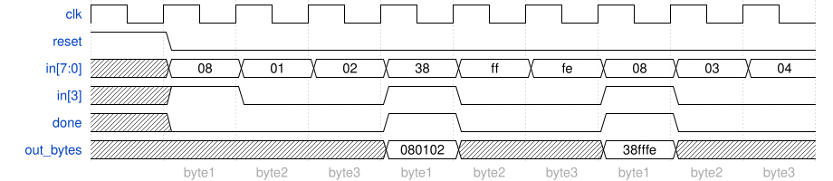

# 錯題本

### circuit10 (147)

分類：verification(reading simulations) - build circuit from simulation waveform
任務：sequential circuit

[HDLBits](https://hdlbits.01xz.net/wiki/Sim/circuit10)

### review2015_fancytimer (156)

[HDLBits](https://hdlbits.01xz.net/wiki/Exams/review2015_fancytimer)

分類：circuits - build larger circuits
任務：timer

### ece241_2013_q4 (149)

分類：circuits - sequential logic - FSM

[HDLBits](https://hdlbits.01xz.net/wiki/Exams/ece241_2013_q4)

### 2013_q2bfsm (139)

分類：circuits - sequential logic - FSM
任務：FSM

[HDLBits](https://hdlbits.01xz.net/wiki/Exams/2013_q2bfsm)

### fsm_serial (137)

分類：circuits - sequential logic - FSM
任務：FSM

[HDLBits](https://hdlbits.01xz.net/wiki/Fsm_serial)

### ece241_2013_q2 (70)

分類：circuits - combinational logic - Kmap to circuit
任務：single-output digital system

[HDLBits](https://hdlbits.01xz.net/wiki/Exams/ece241_2013_q2)

### 2013_q2afsm()

分類：circuits - sequential logic - FSM
任務：FSM

[HDLBits](https://hdlbits.01xz.net/wiki/Exams/2013_q2afsm)

### gatesv100()

分類：circuits - combinational logic - Basic Gates

[HDLBits](https://hdlbits.01xz.net/wiki/Gatesv100)

### fsm_ps2data (154)

分類：circuits - sequential logic - FSM
任務：FSM

[HDLBits](https://hdlbits.01xz.net/wiki/Fsm_ps2data)

### ece241_2014_q3 (93)

分類：circuits - combinational logic - Kmap to circuit
任務：解讀 Kmap + MUX

[HDLBits](https://hdlbits.01xz.net/wiki/Exams/ece241_2014_q3)

## 統計表

| 類別名 | 題數 |
|---------------------------------------------|------|
| circuits - build larger circuits | 1 |
| circuits - combinational logic - Kmap to circuit | 2 |
| circuits - sequential logic - FSM | 5 |
| verification(reading simulations) - build circuit from simulation waveform | 1 |
| circuits - combinational logic - Basic Gates | 1 |