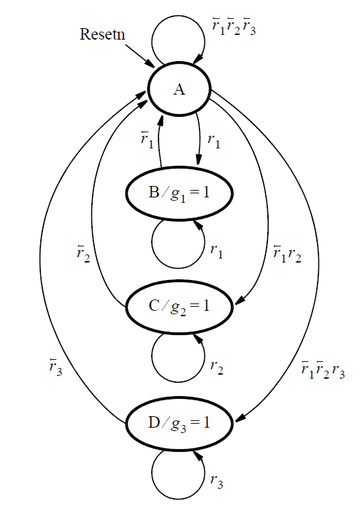

# 錯題本

### circuit10 (147)

分類：verification(reading simulations) - build circuit from simulation waveform

任務：sequential circuit

[HDLBits](https://hdlbits.01xz.net/wiki/Sim/circuit10)


Prompt
```
I would like you to implement a module named TopModule with the following
interface. All input and output ports are one bit unless otherwise
specified.

 - input  clk
 - input  a
 - input  b
 - output q
 - output state

The module should implement a sequential circuit. The circuit consists of
combinational logic and one bit of memory (i.e., one flip-flop). The
output of the flip-flop has been made observable through the output
state. Assume all sequential logic is triggered on the positive edge of
the clock.

Read the simulation waveforms to determine what the circuit does, then
implement it.

  time   clk a   b   state q
  0ns    0   1   x   x     x
  5ns    1   1   x   x     x
  10ns   0   0   0   x     x
  15ns   1   0   0   0     0
  20ns   0   0   0   0     0
  25ns   1   0   0   0     0
  30ns   0   0   0   0     0
  35ns   1   0   0   0     0
  40ns   0   0   0   0     0
  45ns   1   0   1   0     1
  50ns   0   0   1   0     1
  55ns   1   1   0   0     1
  60ns   0   1   0   0     1
  65ns   1   1   1   0     0
  70ns   0   1   1   0     0
  75ns   1   0   0   1     1
  80ns   0   0   0   1     1
  85ns   1   1   1   0     0
  90ns   0   1   1   0     0
  95ns   1   1   1   1     1
  100ns  0   1   1   1     1
  105ns  1   1   1   1     1
  110ns  0   1   1   1     1
  115ns  1   1   0   1     0
  120ns  0   1   0   1     0
  125ns  1   0   1   1     0
  130ns  0   0   1   1     0
  135ns  1   0   0   1     1
  140ns  0   0   0   1     1
  145ns  1   0   0   0     0
  150ns  0   0   0   0     0
  155ns  1   0   0   0     0
  160ns  0   0   0   0     0
  165ns  1   0   0   0     0
  170ns  0   0   0   0     0
  175ns  1   0   0   0     0
  180ns  0   0   0   0     0
  185ns  1   0   0   0     0
  190ns  0   0   0   0     0
```

### review2015_fancytimer (156)

[HDLBits](https://hdlbits.01xz.net/wiki/Exams/review2015_fancytimer)

分類：circuits - build larger circuits

任務：timer

Prompt
```
I would like you to implement a module named TopModule with the following
interface. All input and output ports are one bit unless otherwise
specified.

 - input  clk
 - input  reset
 - input  data
 - output count (4 bits)
 - output counting
 - output done
 - input  ack

The module should implement a timer with one input that:

  (1) is started when a particular input pattern (1101) is detected,
  (2) shifts in 4 more bits to determine the duration to delay,
  (3) waits for the counters to finish counting, and
  (4) notifies the user and waits for the user to acknowledge the timer.

The serial data is available on the data input pin. When the pattern 1101
is received, the circuit must then shift in the next 4 bits,
most-significant-bit first. These 4 bits determine the duration of the
timer delay, referred to as delay[3:0]. After that, the state machine
asserts its counting output to indicate it is counting. Once the 1101 and
delay[3:0] have been read, the circuit no longer looks at the data input
until it resumes searching after everything else is done.

The state machine must count for exactly (delay[3:0] + 1) * 1000 clock
cycles. e.g., delay=0 means count 1000 cycles, and delay=5 means count
6000 cycles. Also output the current remaining time. This should be equal
to delay for 1000 cycles, then delay-1 for 1000 cycles, and so on until
it is 0 for 1000 cycles.

When the circuit isn't counting, the count[3:0] output is don't-care
(4'bx). At that point, the circuit must assert done to notify the user the 
timer has timed out, and waits until input ack is 1 before being reset to 
look for the next occurrence of the start sequence (1101).

The circuit should reset into a state where it begins searching for the
input sequence 1101. The reset signal is active high synchronous. Assume
all sequential logic is triggered on the positive edge of the clock.
```

### ece241_2013_q4 (149)

分類：circuits - sequential logic - FSM

[HDLBits](https://hdlbits.01xz.net/wiki/Exams/ece241_2013_q4)


Prompt
```
I would like you to implement a module named TopModule with the following
interface. All input and output ports are one bit unless otherwise
specified.

 - input  clk
 - input  reset
 - input  s (3 bits)
 - output fr2
 - output fr1
 - output fr0
 - output dfr

A large reservior of water serves several users. In order to keep the
level of water succificently high, three sensors are placed vertically at
5-inch intervals. When the water level is above the highest sensor s[2],
the input flow rate should be zero. When the level is below the lowest
sensor s[0], the flow rate should be at maximum (both Nominal flow valve
and Supplemental flow valve opened). The flow rate when the level is
between the upper and lower sensors is determined by two factors: the
water level and the level previous to the last sensor change. Each water
level has a nominal flow rate associated with it as show in the table
below. If the sensor change indicates that the previous level was lower
than the current level, the flow rate should be increased by opening the
Supplemental flow valve (controlled by dfr).

  Water Level           | Sensors Asserted | Nominal Flow Rate Inputs to be Asserted
  Above s[2]            | s[0], s[1], s[2] | None
  Between s[2] and s[1] | s[0], s[1]       | fr0
  Between s[1] and s[0] | s[0]             | fr0, fr1
  Below s[0]            | None             | fr0, fr1, fr2

Also include an active-high synchronous reset that resets the state
machine to a state equivalent to if the water level had been low for a
long time (no sensors asserted, and all four outputs asserted).
```

### 2013_q2bfsm (139)

分類：circuits - sequential logic - FSM

任務：FSM

[HDLBits](https://hdlbits.01xz.net/wiki/Exams/2013_q2bfsm)

Prompt
```
I would like you to implement a module named TopModule with the following
interface. All input and output ports are one bit unless otherwise
specified.

 - input  clk
 - input  resetn
 - input  x
 - input  y
 - output f
 - output g

Consider a finite state machine that is used to control some type of
motor. The FSM has inputs x and y, which come from the motor, and
produces outputs f and g, which control the motor. There is also a clock
input called clk and a reset input (synchronous, active low) called
resetn. The FSM has to work as follows. As long as the resetn input is
active, the FSM stays in a beginning state, called state A. When the
reset signal is de-asserted, then after the next clock edge the FSM advances 
to another state to set the output f to 1 for one clock cycle and then FSM 
advances again to monitor the x input. If FSM detects the first x=1 value, 
then the FSM will go to next state to detect the following x=0 value, otherwise 
the next state of FSM remains in the same state. 
When detecting x=0 value, FSM goes to next state to detect the last x=1 which 
need to be sent right after a clock cycle, otherwise next state of FSM remains 
in the same state. 
When the last x=1 is detected, g should be set to 1 on the following clock cycle, 
otherwise the FSM goes back to the state to detect the first x=1 value. 
When g is set to 1 after received the last x=1, the FSM starts to monitor the y input 
within the following two clock cyles as described below.
- In the first clock cycle when setting g to 1, if the y becomes value 1, then the FSM enters 
  to another the state that should maintain g = 1 forever until input resetn is active, 
  otherwise, FSM start to check the y in the second clock cycle.
- In the second clock cycle, if the y becomes value 1, then the FSM enters to the state 
  that should maintain g = 1 forever until input resetn is active, otherwise, FSM enters 
  to another new state that set g = 0 forever until input resetn is active.
In the above two clock cycles monitering y, the output g should remains 1. 

Assume all sequential logic is triggered on the positive edge of the clock.
```

### fsm_serial (137)

分類：circuits - sequential logic - FSM

任務：FSM

[HDLBits](https://hdlbits.01xz.net/wiki/Fsm_serial)


Prompt
```
I would like you to implement a module named TopModule with the following
interface. All input and output ports are one bit unless otherwise
specified.

 - input  clk
 - input  reset
 - input  in
 - output done

In many (older) serial communications protocols, each data byte is sent
along with a start bit (0), 8 data bits, and 1 stop bit (1). The line is also at logic 1 when idle.

Implement a finite state machine that will identify when bytes have been
correctly received when given a stream of bits. It needs to identify the
start bit, wait for all 8 data bits, then verify that the stop bit was
correct. If the stop bit does not appear when expected, the FSM must wait
until it finds a stop bit before attempting to receive the next byte.
Include a active-high synchronous reset. Note that the serial protocol
sends the least significant bit first.

Assume all sequential logic is triggered on the positive edge of the clock.
```

### ece241_2013_q2 (70)

分類：circuits - combinational logic - Kmap to circuit

任務：single-output digital system

[HDLBits](https://hdlbits.01xz.net/wiki/Exams/ece241_2013_q2)

Prompt
```
I would like you to implement a module named TopModule with the following
interface. All input and output ports are one bit unless otherwise
specified.

 - input  a
 - input  b
 - input  c
 - input  d
 - output out_sop
 - output out_pos

The module should implement a digital system with four inputs (a,b,c,d)
that generates a logic-1 when 2, 7, or 15 appears on the inputs, and a
logic-0 when 0, 1, 4, 5, 6, 9, 10, 13, or 14 appears. The input
conditions for the numbers 3, 8, 11, and 12 never occur in this system.
For example, 7 corresponds to a,b,c,d being set to 0,1,1,1, respectively.
Determine the output out_sop in minimum sum-of-products form, and the
output out_pos in minimum product-of-sums form.
```

### 2013_q2afsm (148)

分類：circuits - sequential logic - FSM

任務：FSM

[HDLBits](https://hdlbits.01xz.net/wiki/Exams/2013_q2afsm)



Prompt
```
I would like you to implement a module named TopModule with the following
interface. All input and output ports are one bit unless otherwise
specified.

 - input  clk
 - input  resetn
 - input  r (3 bits)
 - output g (3 bits)

The module should implement the FSM described by the state diagram shown
below:

  A        --r0=0,r1=0,r2=0--> A
  A        -------r0=1-------> B
  A        -----r0=0,r1=1----> C
  A        --r0=0,r1=0,r2=0--> D
  B (g0=1) -------r0=1-------> B
  B (g0=1) -------r0=0-------> A
  C (g1=1) -------r1=1-------> C
  C (g1=1) -------r1=0-------> A

Resetn is an active-low synchronous reset that resets into state A. This
FSM acts as an arbiter circuit, which controls access to some type of
resource by three requesting devices. Each device makes its request for
the resource by setting a signal _r[i]_ = 1, where _r[i]_ is either
_r[0]_, _r[1]_, or _r[2]_. Each r[i] is an input signal to the FSM, and
represents one of the three devices. The FSM stays in state _A_ as long
as there are no requests. When one or more request occurs, then the FSM
decides which device receives a grant to use the resource and changes to
a state that sets that device's _g[i]_ signal to 1. Each _g[i]_ is an
output from the FSM. There is a priority system, in that device 0 has a
higher priority than device 1, and device 2 has the lowest priority.
Hence, for example, device 2 will only receive a grant if it is the only
device making a request when the FSM is in state _A_. Once a device, _i_,
is given a grant by the FSM, that device continues to receive the grant
as long as its request, _r[i]_ = 1.

Implement a module that represents this FSM. Use separate always blocks
for the state table and the state flip-flops, as done in lectures.
Describe the FSM outputs, _g[i]_, using either continuous assignment
statement(s) or an always block (at your discretion). Assign any state
codes that you wish to use. Assume all sequential logic is triggered on
the positive edge of the clock.
```

### gatesv100 (92)

分類：circuits - combinational logic - Basic Gates

[HDLBits](https://hdlbits.01xz.net/wiki/Gatesv100)

Prompt
```
I would like you to implement a module named TopModule with the following
interface. All input and output ports are one bit unless otherwise
specified.

 - input  in            (100 bits)
 - output out_both      (100 bits)
 - output out_any       (100 bits)
 - output out_different (100 bits)

The module takes as input a 100-bit input vector in[99:0] and should
produce the following three outputs:

  (1) out_both: Each bit of this output vector should indicate whether
  both the corresponding input bit and its neighbour to the left are '1'.
  For example, out_both[98] should indicate if in[98] and in[99] are both
  1. Since in[99] has no neighbour to the left, the answer is obvious so
  simply set out_both[99] to be zero.

  (2) out_any: Each bit of this output vector should indicate whether any
  of the corresponding input bit and its neighbour to the right are '1'.
  For example, out_any[2] should indicate if either in[2] or in[1] are 1.
  Since in[0] has no neighbour to the right, the answer is obvious so
  simply set out_any[0] to be zero.

  (3) out_different: Each bit of this output vector should indicate
  whether the corresponding input bit is different from its neighbour to
  the left. For example, out_different[98] should indicate if in[98] is
  different from in[99]. For this part, treat the vector as wrapping
  around, so in[99]'s neighbour to the left is in[0].
```

### fsm_ps2data (154)

分類：circuits - sequential logic - FSM

任務：FSM

[HDLBits](https://hdlbits.01xz.net/wiki/Fsm_ps2data)


Prompt
```
I would like you to implement a module named TopModule with the following
interface. All input and output ports are one bit unless otherwise
specified.

 - input  clk
 - input  reset
 - input  in (8 bits)
 - output out_bytes (24 bits)
 - output done

The module should implement a finite state machine (FSM) that will search for
message boundaries when given an input byte stream. When we see one byte with 
in[3]=1. We then assume that this is the byte 1 of a message and continue to 
receive the following 2 bytes (done). The FSM should signal done to 1 in
the cycle immediately after the third byte of each message was successfully received.

Implement the datapath module that will output the 24-bit (3 byte)
message whenever a packet is received (out_bytes[23:16] is the first
byte, out_bytes[15:8] is the second byte, etc.). The reset signal is
active high synchronous. out_bytes needs to be valid whenever the done
signal is asserted. The out_bytes should be 24'bx at other times (i.e., don't-care). Assume all sequential logic is triggered on the positive
edge of the clock.
```

### ece241_2014_q3 (93)

分類：circuits - combinational logic - Kmap to circuit

任務：解讀 Kmap + MUX

[HDLBits](https://hdlbits.01xz.net/wiki/Exams/ece241_2014_q3)


Prompt
```
I would like you to implement a module named TopModule with the following
interface. All input and output ports are one bit unless otherwise
specified.

 - input  c
 - input  d
 - output mux_in (4 bits)

For the following Karnaugh map, give the circuit implementation using one
4-to-1 multiplexer and as many 2-to-1 multiplexers as required, but using
as few as possible. You are not allowed to use any other logic gate and
you must use a and b as the multiplexer selector inputs, as shown on
the 4-to-1 multiplexer below.

[Karnaugh Map]
             a,b      
  c,d  0,0 0,1 1,1 1,0
  0,0 | 0 | 0 | 0 | 1 |
  0,1 | 1 | 0 | 0 | 0 |
  1,1 | 1 | 0 | 1 | 0 |
  1,0 | 1 | 0 | 0 | 1 |

Consider a block diagram with inputs 'c' and 'd' going into a module
called "TopModule". This "TopModule" has four outputs, mux_in[3:0], that
connect to a four input mux. The mux takes as input {a,b}. 
Output mux_in[0] is with {a,b} = {0,0}, mux_in[1] 
is with {a,b} = {0,1}, mux_in[2] is with {a,b} = {1,0}, 
and mux_in[3] is with {a,b} = {1,1}. 

You are implementing in Verilog just the portion labelled "TopModule", such 
that the entire circuit (including the 4-to-1 mux) implements the K-map.
```

## 統計表

| 類別名 | 題數 |
|---------------------------------------------|------|
| circuits - build larger circuits | 1 |
| circuits - combinational logic - Kmap to circuit | 2 |
| circuits - sequential logic - FSM | 5 |
| verification(reading simulations) - build circuit from simulation waveform | 1 |
| circuits - combinational logic - Basic Gates | 1 |